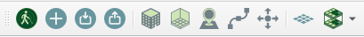

---
hide:
  - navigation
---

# Reference Point Navigation Map Builder Plugin

## Installation

The current release of the plugin can be downloaded [here](https://github.com/ReferencePointNavigation/MapCreator/releases).

| :exclamation:  In order to function correctly, the [OpenLayers](https://github.com/sourcepole/qgis-openlayers-plugin) plugin must be installed and enabled. |
|---------------------------------------------------------------------------------------------------------------------------------------------------------------|

## Map Files

The `.rpn` files generated by the Map Builder Plugin are a standard [`.zip`](https://en.wikipedia.org/wiki/ZIP_(file_format)) file which contains the map data in serialized protobuf format. Full documentation of the protocol buffer definitions can be found [here](proto.md)

### Map file contents

- The `.map` file corresponds to the [Map.proto](proto.md#map) definition. This is the "index" of all of the other objects (Buildings, Paths etc.) in the `.rpn` file. Clients should extract this file first and use the `buildings` field to extract the required buildings as needed. This greatly reduces the amount of data that needs to be deserialized and loaded into memory.

- The `.bldg` file corresponds to the [Building.proto](proto.md#building) definiton.

| :exclamation:  top level paths and landmarks have not yet been implemented |
|----------------------------------------------------------------------------|

## The Plugin

The Map Builder plugin installs a toolbar in QGis that allows the user to import, edit and export maps in the `.rpn` format.

| Tool | Description |
|------|-------------|
|   | Shows the plugin about screen (not implemented)  |
|     | Creates a new empty map  |
|   | Opens an existing map  |
|   | Saves the current map  |
|   | Add a new building to the map  |
|   | Add a new navigable space to a building  |
|   | Add a new landmark to the map  |
|   | Add a new path to the map  |
|   | Move an object on the map  |
|   | Show the minimap grid :exclamation: can be computationally expensive  |
|   | Show objects on different building levels  |
